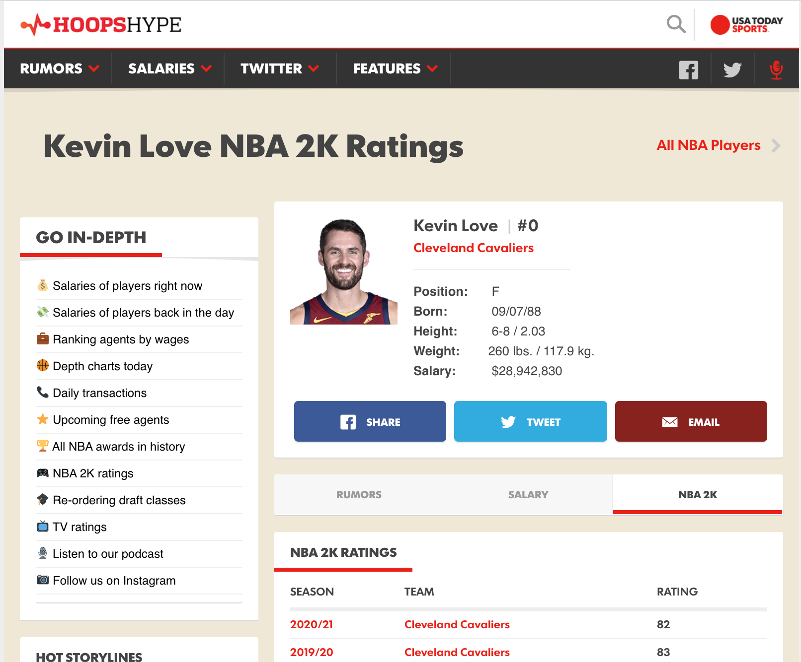
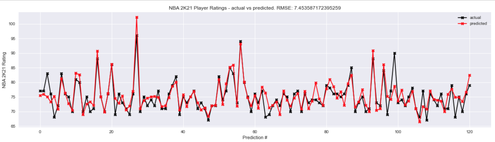

# Predicting NBA 2K21 Ratings

Every year, the basketball world waits at the ready for the latest installment of the NBA 2K video game series to release. NBA 2K video games simulate the action on the court with impeccable detail. The two main things basketball fanatics look for in the latest 2K video game are the [cover athletes](https://www.nba.com/news/nba-2k21-cover-athletes-lillard-zion), and the **2K ratings, a numerical representation of a player's skill level on the court**.

My project focuses on these 2K ratings, predicts them based on player stats, and finds which statistical categoies most influence a players rating.

*A NBA 2K21 screehshot of Golden State Warriors star Stephen Curry*

## Rating Calculation

As written in [this Complex article](https://www.complex.com/sports/2017/10/how-nba-2k-determines-player-rankings), "every year, these ratings are held up to scrutiny—sometimes by the fans and critics, but most often by the players themselves." Every player believes he is worth higher than the number 2K assigns them.

Caltulating ratings is a long, complicated, and exhausting process, but generally speaking, a player's overall 2K rating is an aggregation of their ratings in certain cetagories like defending, rebounding, inside/outside scoring (among others), in addition to their archetype. For example [versatile point guard Chris Paul's](https://www.2kratings.com/chris-paul) archetype is 'All-Around 2-Way', while the [highly specialized J.J. Redick's](https://www.2kratings.com/jj-redick) archetype is "Sharpshooter".

## Gathering Data

I got my data from two sources.

I got total player statistics for the most recent 2019-2020 NBA season from [this page on basketball-reference.com](https://www.basketball-reference.com/leagues/NBA_2020_totals.html).

I webscraped 2K ratings data from HoopsHype.com. Below is a sample page that I webscraped from. 

*I wanted to webscrape the '82' next to "Cleveland Cavaliers" since that is Kevin Love's most recent rating*

### Challenges

A challenge I experienced in gathering data was web scraping. I originially wanted to scrape from the [offical 2K ratings website](https://www.2kratings.com/), but I wasn not able work with the `` tags in the site's HTML. I used [HoopsHype.com](https://hoopshype.com/) because the HTML was easier to work with. 

HoopsHype was rather unique in its construction of web links. Most of the time, the version of the players name that went into the link was just a lower cased and hyphenated version of their real name. (Example: Jimmy Butler went down as jimmy-butler)

However, I did have to hardcode about 20 (out of 500+) NBA player's names (many of whose names contained initials like "J.J.", suffixes like "Jr" or "III"), since they didn't follow the usual convention. I took no pride in doing this, but could't not think of a way around it. 

Definitely contact me at `karkhanis.hursh@gmail.com` if you know a way around this!

## Prediction With Linear Regression

My features were the player's total statistics, position, and team (both dummified). 

My target was the player's 2K rating. 

I split my data into 80% train and 20% test and ran Linear Regression to get a very low root mean squared error of about 7.5 . This means the model had an average error of 7.5 points for any given 2K rating (ratings range from 68 to 99)

The graph showing actual vs predicted 2K ratings is below.

## Feature Importance

Feature importance tells the user which features were most influencial in the model's prediction. The feature importance on my model showed that these were the most influencial statistics in a player's 2k rating. 

Statistic | Importance (max score: 1)
------------ | -------------
Minutes Played | 0.726
Points | 0.541
Free Throws Attempted | 0.235
Steals | 0.127
Assists | 0.084
Games Played  | 0.070
Turnovers | 0.067
Field Goals Attempted | 0.057
Free Throws Made | 0.049

No surprised that Minutes Played and Points are at the top, since coaches tend to play their better players more minutes, and scoring is generally the most important statistic in basketball. 

I was personally surprised that Steals was so high on the list. This may be attributed to a decreased NBA-wide emphasis being placed on defense. 

## Conclusion

My interpretation of these results is that since there aren't many defensive specialists in the league anymore, players that *are* defensive specialists and get lots of steals are rated high since that skill is in low supply and thus at a premium.

